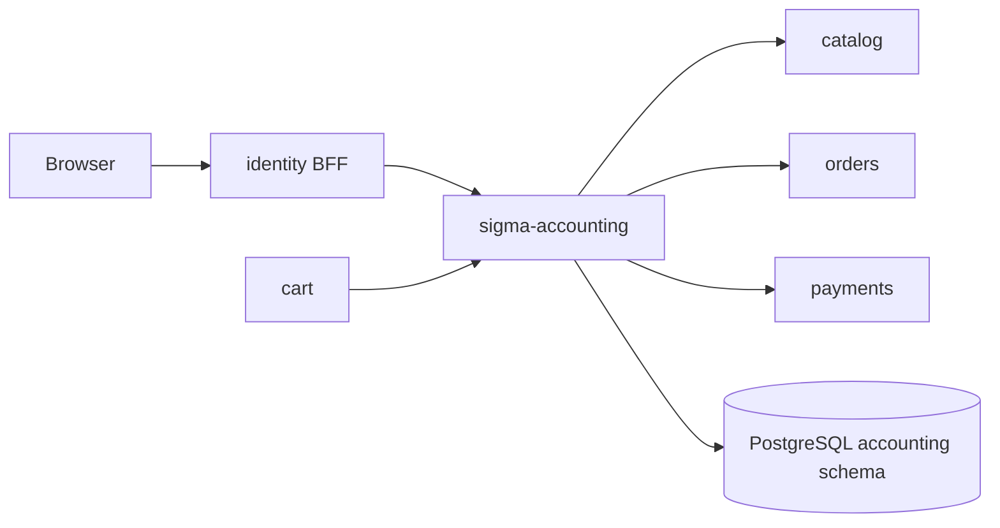

# sigma-accounting architecture

`sigma-accounting` is the internal accounting service for Sigma Tactical Group. It records bills, expenses, integrations, and checkout deposit receipts, and exposes an admin UI plus a JSON API for peer services.

## Context

This service owns the PostgreSQL `accounting` schema: `bills`, `bill_line_items`, `integrations`, `expenses`, and `receipts`.

## Runtime shape

The `sigma-accounting` binary connects `AccountingStore` to PostgreSQL, then hands `sigma_accounting::routes(store)` to `sigma_theme::warp::serve`, which builds the multithreaded Tokio runtime and serves until shutdown. The theme crate supplies the Warp server, termination behaviour, shared static assets, themed error recovery, security headers, and the listen address from `PORT`.

The process holds a connection pool to the shared `sigma` database under the `accounting` role. Optional HTTP clients reach catalog, orders, and payments when their base URLs are configured.

## Request flow

`routes()` combines server-rendered admin pages from `web.rs` with JSON handlers from `api.rs`. `sigma_theme::warp::site_routes` also supplies `/up`, `/static/*`, and `/favicon.ico`; `sigma_pg::health::warp::health_routes` adds `/health`.

Admin routes list and edit bills, expenses, integrations, and the receipt reconcile view. The JSON API sits behind the internal token filter and serves `/bills`, `/expenses`, `/integrations`, `/receipts`, and `/catalog/skus` (catalog proxy). Cart pushes deposit receipts on checkout; the reconcile page sweeps the payments charge log.

## Code map

| Path | Responsibility |
| --- | --- |
| `src/main.rs` | Connects the store and starts the theme Warp server. |
| `src/lib.rs` | Assembles web UI, JSON API, health, theme, CSP, and rejection routes. |
| `src/config.rs` | Reads public URLs and optional peer-service base URLs. |
| `src/store.rs` | PostgreSQL persistence for bills, expenses, integrations, and receipts. |
| `src/model/` | Domain types for bills, expenses, receipts, and integrations. |
| `src/api.rs` | Internal-token JSON CRUD and catalog proxy. |
| `src/web.rs` | Server-rendered admin UI. |
| `src/catalog.rs` | HTTP client to the catalog service. |
| `src/orders.rs` | HTTP client to orders for `order_id` validation. |
| `src/payments.rs` | HTTP client to payments for receipt reconcile. |
| `src/templates/` | Askama HTML for admin pages. |

## Data

PostgreSQL schema `accounting` holds bills and line items, vendor integrations, expenses, and receipts. Receipts are idempotent on `charge_id`. Cross-service references (`order_id`, `charge_id`) are opaque HTTP identifiers, not foreign keys into peer schemas.

## Configuration

| Environment variable | Purpose |
| --- | --- |
| `PORT` | Listen port supplied to the theme crate. |
| `ACCOUNTING_PUBLIC_BASE_URL` | Public base URL of this service. |
| `ACCOUNTING_IDENTITY_PUBLIC_URL` | Identity BFF URL for navbar links and CSP `connect-src`. |
| `ACCOUNTING_CONTACT_PUBLIC_URL` | Contact-service URL for the shared chrome. |
| `ACCOUNTING_CART_PUBLIC_URL` | Cart-service URL for the shared chrome. |
| `ACCOUNTING_CATALOG_BASE_URL` | Optional catalog integration base URL. |
| `ACCOUNTING_ORDERS_BASE_URL` | Optional internal orders API for `order_id` validation. |
| `ACCOUNTING_ORDERS_PUBLIC_URL` | Optional public orders admin URL for bill links. |
| `ACCOUNTING_PAYMENTS_BASE_URL` | Optional internal payments API for receipt reconcile. |
| `DATABASE_URL` | PostgreSQL connection URL for the shared Sigma database. |

## Deployment

`Dockerfile` produces the `sigma-accounting` image. The platform deployment is at `../platform/services/accounting/base/deployment.yaml`; it exposes container port `8080` through `../platform/services/accounting/base/service.yaml` on service port `80`.

The public VirtualService and environment overlays reside beside the base manifests under `../platform/services/accounting/`. Production hostname and platform context are documented in [`../platform/README.md`](../platform/README.md).

## Testing

Run `cargo test -p sigma-accounting`. Integration tests in `src/lib.rs` cover `/up`, the index page, JSON API CRUD, receipt idempotency, and catalog `503` when unconfigured. Tests use `sigma_pg::test_helpers::ready_store`.

## Design notes

- Cart receipt push is best-effort; accounting reconcile can backfill from the payments charge log.
- Admin UI and JSON API are intended behind the identity BFF proxy in production.
- Custom CSP extends the theme defaults with the identity origin for `connect-src`.
